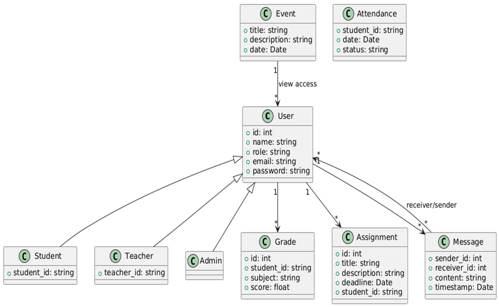
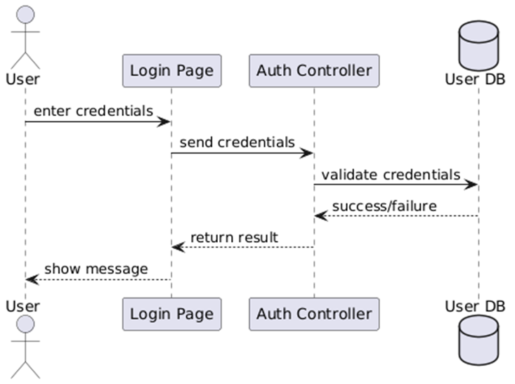
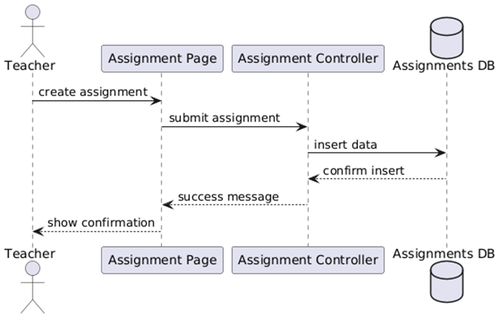
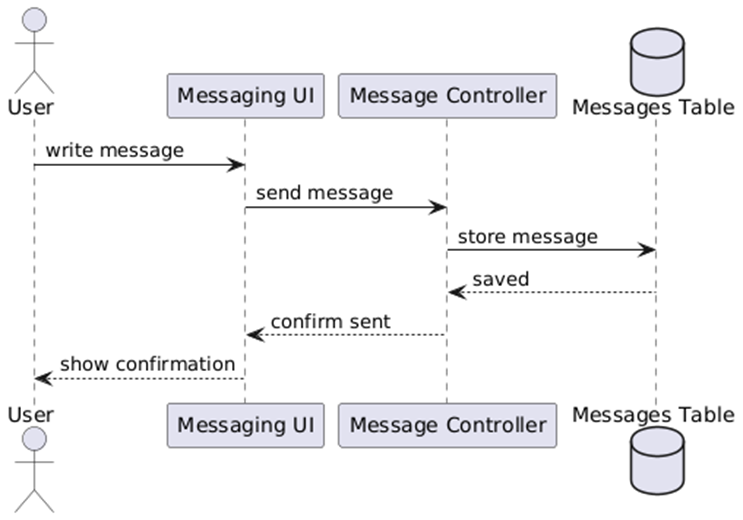
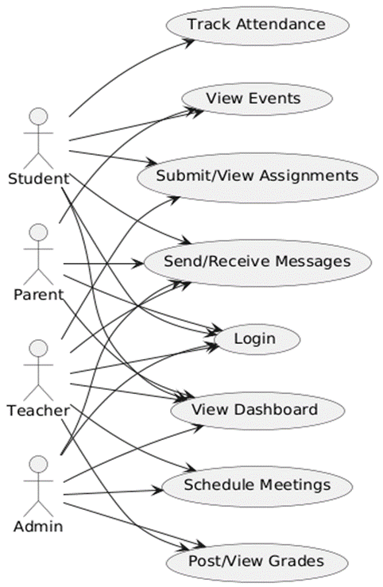
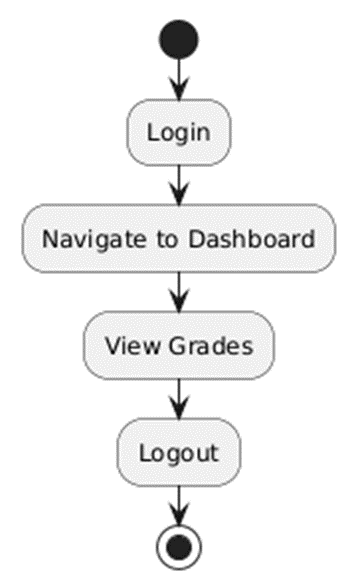
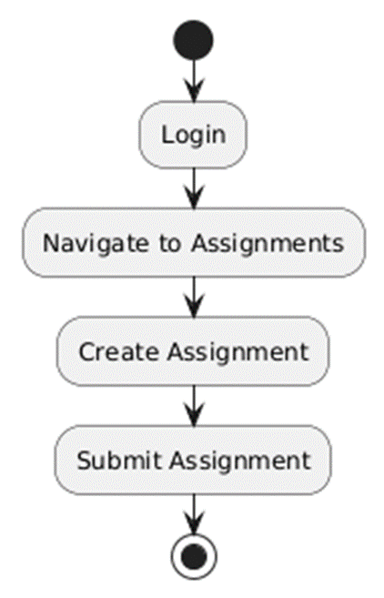
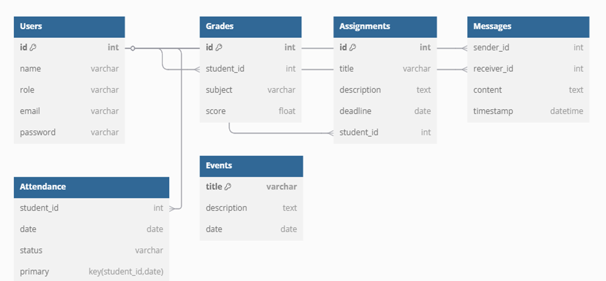

# Sarina Highschool Interactive System

## Phase III: Software Design and Modeling

### Group Name:
**Sarina Highschool Interactive System**

---

## Software Architecture

### System Architecture
The Sarina Highschool Interactive System employs a modular, layered architecture designed for scalability and maintainability. The system comprises three primary layers:

#### 1. Presentation Layer (Frontend)
- **Technologies**: HTML, CSS, JavaScript
- **Responsibilities**:
  - Interacting with users including students, parents, teachers, and administrators.
  - Displaying dashboards, schedules, messages, and grade reports.

#### 2. Business Logic Layer (Backend)
- **Technologies**: PHP
- **Responsibilities**:
  - Handling core application logic including authentication, data processing, and user role management.

#### 3. Data Layer (Database)
- **Technology**: MySQL
- **Responsibilities**:
  - Managing persistent data such as user accounts, grades, messages, attendance records, and events.

All layers communicate through API calls or server requests, with role-based access control to ensure data security and efficient session handling to enhance user experience.

---

## Diagrams

### Component Diagram

### Class Diagram

Log-in Sequence Diagram
### Sequence Diagrams
- **Log-in Sequence Diagram**:

  
- **Teacher Sequence Diagram**:

  
- **Message Sequence Diagram**:

### Use Case Diagram

### Activity Diagrams
- **Log-in Activity Diagram**:

  
- **Assignment Activity Diagram**:

---

## Database Design

The project utilizes a relational database structure for organized data management. The database consists of multiple tables:
- **Users Table**: Stores user information such as names, emails, and roles.
- **Grades Table**: Holds student scores.
- **Assignments Table**: Contains details of assignments.
- **Messages Table**: Manages communications within the system.
- **Attendance Table**: Tracks attendance records.
- **Events Table**: Keeps information about various events.

The tables are interconnected using foreign keys to clearly associate grades, assignments, and other relevant data to individual students. This structure ensures database efficiency, prevents data redundancy, and facilitates future scalability.

